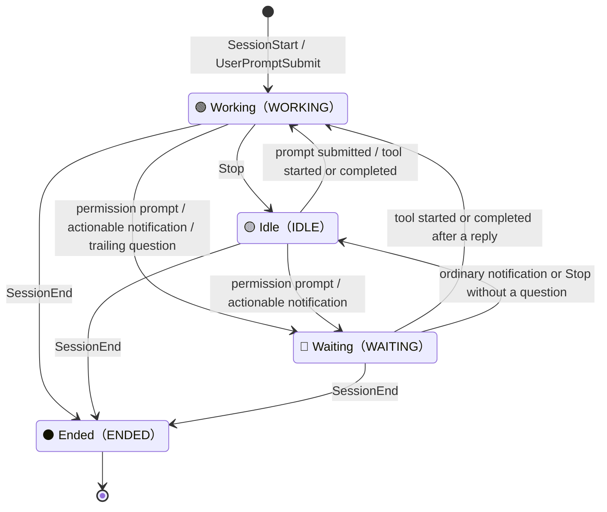

# Session States

RiNG reduces every tracked session to four states, defined by `Status` in
[`src/ring/registry.py`](https://github.com/Lee-W/ring/blob/main/src/ring/registry.py):

- 🔴 **Waiting (`WAITING`)**: the session needs a decision, such as permission, an answer, or a choice.
- 🟢 **Working (`WORKING`)**: the agent is running, a prompt was just submitted, or a tool call is in flight.
- 🟡 **Idle (`IDLE`)**: the current turn finished and RiNG does not believe immediate action is required.
- ⚫ **Ended (`ENDED`)**: the session ended or its local record aged past the active window.

The diagram shows the most common hook-mode transitions. Labels include the actual hook event names where useful; explicit payload fields can still override the ordinary result, as described below.

## Event Reference

- **`SessionStart` / `UserPromptSubmit` → `WORKING`**: unconditional; a new session or a user reply means the agent is working.
- **`Stop` → `IDLE` or `WAITING`**: normalization defaults to `IDLE`. When `detect_stop_questions` is enabled and the last plain-text assistant message ends with a recognized question, the hook handler promotes it to `WAITING` with `waiting_kind=question`.
- **Bare `PermissionRequest` → `WORKING`**: this event only proves that the provider is evaluating permission. Many calls are auto-approved by policy, so it cannot immediately mean “needs you.” A payload that explicitly requires interaction still becomes `WAITING`.
- **Claude Code permission wait → `WAITING`**: when Claude Code actually stops, a later `permission_prompt` notification marks the session waiting and reuses the concrete command detail captured from the bare permission event.
- **Codex permission wait → delayed `WAITING`**: Codex has no later notification. If the last event remains a bare `PermissionRequest` beyond `codex_permission_wait_seconds`, the read path promotes that hook row to `WAITING`; any later hook event clears the condition.
- **`PreToolUse` → `WAITING` or `WORKING`**: `AskUserQuestion`, or non-empty `questions`, `options`, or `choices`, means `WAITING`; any other tool start means `WORKING`.
- **`PostToolUse` → `WORKING`**: the tool ran, so the prior interaction was handled and any stale waiting state is cleared.
- **`Notification` → `WAITING` or `IDLE`**: `permission_prompt`, `elicitation_dialog`, or another action-required payload means `WAITING`; an ordinary notification means `IDLE`.
- **Explicit override**: `requires_action`, `action_required`, `needs_user_action`, `requires_input`, `interactive`, or a recognized `waiting_for` value takes precedence and selects `WAITING` / `IDLE`. `SessionStart`, `UserPromptSubmit`, and `SessionEnd` are not overridden.
- **`SessionEnd` → `ENDED`**: the hook handler deletes the registry file, so the session leaves the default board. Visible `ENDED` rows mainly come from zero-config records aging beyond the active window.

## Zero-Config Mode

Without hooks, RiNG can only infer `WORKING`, `IDLE`, and `ENDED` from local records, processes, and idle time. The zero-config scan never guesses `WAITING`; precise waiting comes from hook payloads, trailing-question detection on Stop, or the delayed Codex permission rule.
