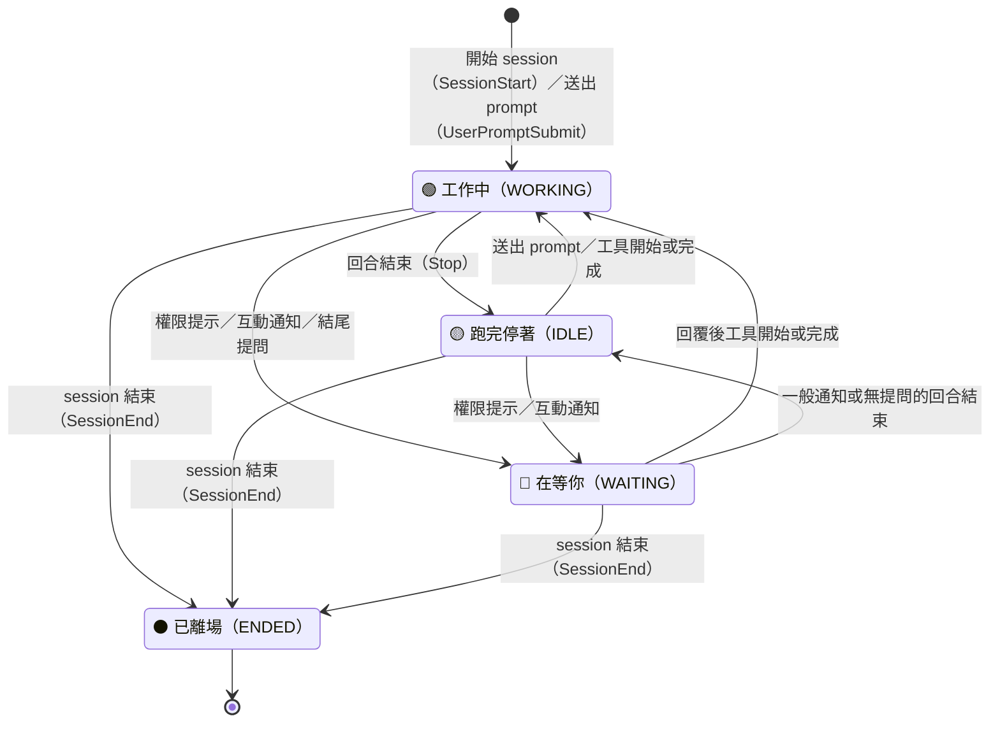

# Session 狀態

RiNG 把每個追蹤中的 session 收斂成四種狀態，定義在
[`src/ring/registry.py`](https://github.com/Lee-W/ring/blob/main/src/ring/registry.py) 的 `Status`：

- 🔴 **在等你（`WAITING`）**：session 需要你做決定，例如核准權限、回答問題或選擇選項。
- 🟢 **工作中（`WORKING`）**：agent 正在執行，剛送出 prompt，或有工具呼叫正在進行。
- 🟡 **跑完停著（`IDLE`）**：這一回合已結束，RiNG 不認為你需要立刻動作。
- ⚫ **已離場（`ENDED`）**：session 已結束，或本機紀錄已超過活躍時間窗。

下圖顯示 hook 模式最常見的狀態轉換。箭頭使用台灣華語描述，括號內保留實際 hook 事件名稱；payload 的顯式欄位仍可能覆寫一般結果，完整規則列在圖後。

## 事件對照表

- **`SessionStart` / `UserPromptSubmit` → `WORKING`**：無條件，新的 session 或使用者剛回話都代表 agent 開始工作。
- **`Stop` → `IDLE` 或 `WAITING`**：正規化的預設結果是 `IDLE`；如果 `detect_stop_questions` 開啟，而且最後一則 assistant 純文字訊息的結尾被辨識為提問，hook handler 會把它升成 `WAITING`，`waiting_kind` 設為 `question`。
- **裸 `PermissionRequest` → `WORKING`**：事件只代表 provider 正在進行權限判定，許多呼叫會被 policy 自動放行，因此不能立即當成「需要你」。若 payload 明確要求互動，仍直接成為 `WAITING`。
- **Claude Code 權限等待 → `WAITING`**：真的停下來等待時，後續 `permission_prompt` notification 會把 session 標成 `WAITING`；先前裸權限事件裡的具體指令摘要會沿用成等待內容。
- **Codex 權限等待 → 延遲升成 `WAITING`**：Codex 沒有後續 notification。若最後事件仍是裸 `PermissionRequest`，且 hook 靜默時間超過 `codex_permission_wait_seconds`，讀取側會把該 hook row 升成 `WAITING`；任何後續事件都會清掉這項判定。
- **`PreToolUse` → `WAITING` 或 `WORKING`**：`AskUserQuestion`，或 payload 帶有非空的 `questions`、`options`、`choices` 時是 `WAITING`；其餘工具開始執行時是 `WORKING`。
- **`PostToolUse` → `WORKING`**：工具已經執行，代表先前的互動已處理，並清掉殘留的等待狀態。
- **`Notification` → `WAITING` 或 `IDLE`**：`permission_prompt`、`elicitation_dialog` 或其他需要動作的 payload 是 `WAITING`；一般通知是 `IDLE`。
- **顯式覆寫**：payload 的 `requires_action`、`action_required`、`needs_user_action`、`requires_input`、`interactive`，或可辨識的 `waiting_for` 會優先決定 `WAITING` / `IDLE`。`SessionStart`、`UserPromptSubmit` 與 `SessionEnd` 不受這項覆寫影響。
- **`SessionEnd` → `ENDED`**：hook handler 直接刪除 registry 檔，session 會從預設看板消失；看板上可見的 `ENDED` 主要來自零設定掃描超過活躍時間窗的紀錄。

## 零設定模式

沒有 hooks 時，RiNG 只能依本機紀錄、process 與閒置時間推算 `WORKING`、`IDLE`、`ENDED`。零設定掃描不會自行猜測 `WAITING`；精準等待狀態來自 hook payload、Stop 結尾提問偵測，或 Codex 裸權限事件的延遲判定。
